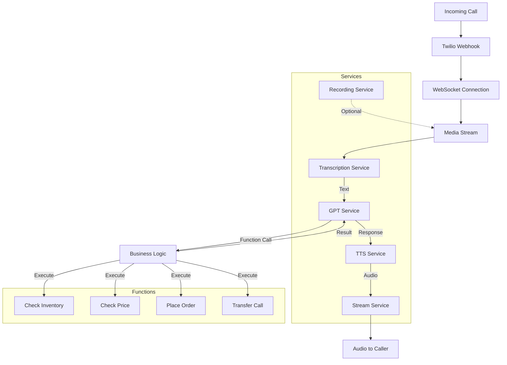

# Project State Report

## Overview

This project implements an intelligent voice-enabled application that handles both inbound and outbound calls using Twilio's Media Streams API. It integrates several key technologies including Deepgram for speech-to-text and text-to-speech conversion, GPT-4 for natural language processing, and a WebSocket-based streaming service for real-time audio communication.

## Core Components

### 1. Main Application (app.js)

- Serves as the entry point and orchestrator
- Handles WebSocket connections and Twilio webhook endpoints
- Coordinates communication between different services
- Manages the call flow and audio streaming

### 2. Services

#### Transcription Service

- Utilizes Deepgram's SDK for real-time speech-to-text
- Handles continuous audio stream processing
- Manages speech finalization and utterance detection
- Emits transcription events for further processing

#### GPT Service

- Integrates with OpenAI's GPT-4 model
- Maintains conversation context
- Processes transcribed text and generates responses
- Supports function calling for specific actions

#### Text-to-Speech Service

- Converts GPT responses to audio using Deepgram's TTS API
- Handles audio encoding and streaming
- Manages response buffering and delivery

#### Stream Service

- Manages WebSocket communication with Twilio
- Handles audio streaming and buffering
- Coordinates media events and markers

#### Recording Service

- Optional service for call recording
- Activated through environment configuration

### 3. Functions

- checkInventory: Inventory verification functionality
- checkPrice: Price checking capability
- placeOrder: Order processing system
- transferCall: Call transfer functionality

## Technical Details

### Environment Configuration

- Uses dotenv for environment variable management
- Configurable ports and API keys
- Optional recording capability

### Communication Flow

1. Incoming call triggers Twilio webhook
2. WebSocket connection established for media streaming
3. Audio stream processed by Transcription Service
4. Transcribed text sent to GPT Service
5. GPT response converted to speech
6. Audio streamed back to caller

### Error Handling

- Comprehensive error catching in WebSocket connections
- Service-level error management
- Graceful degradation on API failures

## Testing

- Unit tests for core functions
- Test coverage for inventory, pricing, and order operations
- Call transfer testing capabilities

## Deployment

- Docker support for containerization
- Fly.io deployment configuration available
- Environment-based configuration management

